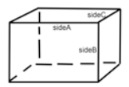
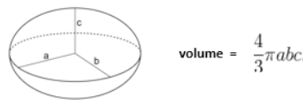
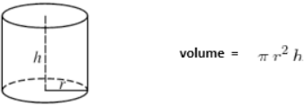
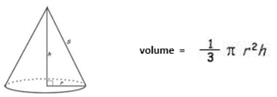

# Assignment: Volumes

## Learning Objectives

- Use a do-while loop to provide the user repeatedly with a choice
- Practice the use of a switch statement
- Overload methods
- Declare static methods and call them in the same class as well as from another class
- Call members of class Math based on the information provided in the Java API
- Formulate algorithms

## Project Description

Create a project called AssignmentVolumes with two Java files:

- `Volumes.java`
- `VolumesMenu.java`

Starter code is available for download:

- Volumes.java
- VolumesMenu.java

Follow style guidelines and best practices discussed in class:

- Proper indentation
- Descriptive names
- Avoid code duplication
- etc.

## Class: Volumes

### UML Class Diagram

All members of the class are static. This works well because none of the methods relies on data from a specific
instance.

Note: the UML diagram shows 'Double' (capitalized), but use the primitive type 'double' in your Java implementation.

All methods should return a value. No print statements should be used in class Volumes.

### Methods to Implement

#### 1. cuboid



`cuboid` is an overloaded method:

- First, implement the 3-parameter cuboid method
- Then implement the one-parameter method by calling the 3-parameter method

#### 2. ellipsoid



`ellipsoid` is an overloaded method:

- First, implement the 3-parameter ellipsoid method
- Then implement the one-parameter method by calling the 3-parameter method

#### 3. cylinder



#### 4. cone



**Caveat**: The method cone receives the diameter and the side as parameters; however, the volume formula provided uses
the radius and the height.

### Helpful Math Class Methods

- `Math.PI` - The double value that is closer than any other to pi
- `Math.pow(double a, double b)` - Returns the value of the first argument raised to the power of the second argument
- `Math.sqrt(double a)` - Returns the correctly rounded positive square root of a double value
- `Math.hypot(double x, double y)` - Returns sqrt(x² + y²) without intermediate overflow or underflow

More info about the Math class: [Java 8 Math API](http://download.oracle.com/javase/8/docs/api/java/lang/Math.html)

## Class: VolumesMenu

### Methods

- `main` - Entry point of the program
- `menuPrompt` - Already provided in the starter code

### Modifying the main Method

The starter code has a commented-out main method. After implementing the Volumes class, modify the main method to:

1. Create an instance of type Scanner to read user selections (not shape sizes)
2. Use a do-while loop to repeat the following actions:
    - Call the method menuPrompt to offer the user choices
    - Read in the user choice and assign the result to the variable selection
    - In a switch statement, check for the number the user entered:
        - If 1: call cuboid(2, 4, 6) and display the result
        - If 2: call cuboid(4) and display the result
        - If 3: call ellipsoid(2, 4, 6) and display the result
        - If 4: call ellipsoid(4) and display the result
        - If 5: call cylinder(3, 4) and display the result
        - If 6: call cone(6, 5) and display the result
        - If 0: print "goodbye"
        - If any other number: print "invalid input"

## Sample Output

```
1 .. cuboid(2, 4, 6)      2 .. cuboid(4)
3 .. ellipsoid(2, 4, 6)   4 .. ellipsoid(4)
5 .. cylinder(3, 4)       6 .. cone(6, 5)
0 .. exit               
Your choice: 1
cuboid(2, 4, 6): volume = 48.0

1 .. cuboid(2, 4, 6)      2 .. cuboid(4)
3 .. ellipsoid(2, 4, 6)   4 .. ellipsoid(4)
5 .. cylinder(3, 4)       6 .. cone(6, 5)
0 .. exit               
Your choice: 2
cuboid(4): volume = 64.0

1 .. cuboid(2, 4, 6)      2 .. cuboid(4)
3 .. ellipsoid(2, 4, 6)   4 .. ellipsoid(4)
5 .. cylinder(3, 4)       6 .. cone(6, 5)
0 .. exit               
Your choice: 3
ellipsoid(2, 4, 6): volume = 201.1

1 .. cuboid(2, 4, 6)      2 .. cuboid(4)
3 .. ellipsoid(2, 4, 6)   4 .. ellipsoid(4)
5 .. cylinder(3, 4)       6 .. cone(6, 5)
0 .. exit               
Your choice: 4
ellipsoid (4): volume = 268.1

1 .. cuboid(2, 4, 6)      2 .. cuboid(4)
3 .. ellipsoid(2, 4, 6)   4 .. ellipsoid(4)
5 .. cylinder(3, 4)       6 .. cone(6, 5)
0 .. exit               
Your choice: 5
cylinder(3, 4): volume = 113.1

1 .. cuboid(2, 4, 6)      2 .. cuboid(4)
3 .. ellipsoid(2, 4, 6)   4 .. ellipsoid(4)
5 .. cylinder(3, 4)       6 .. cone(6, 5)
0 .. exit               
Your choice: 6
cone(6, 5): volume = 37.7

1 .. cuboid(2, 4, 6)      2 .. cuboid(4)
3 .. ellipsoid(2, 4, 6)   4 .. ellipsoid(4)
5 .. cylinder(3, 4)       6 .. cone(6, 5)
0 .. exit               
Your choice: 7
invalid input

1 .. cuboid(2, 4, 6)      2 .. cuboid(4)
3 .. ellipsoid(2, 4, 6)   4 .. ellipsoid(4)
5 .. cylinder(3, 4)       6 .. cone(6, 5)
0 .. exit               
Your choice: 0
good bye
```